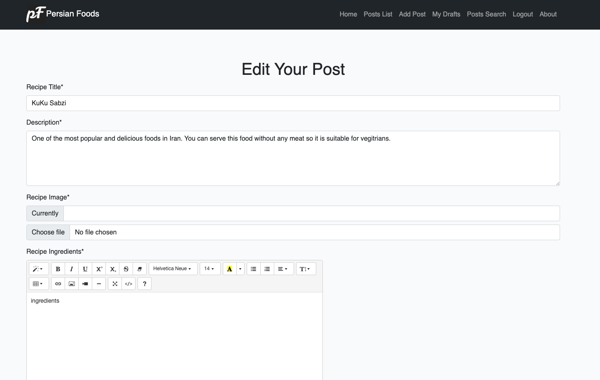
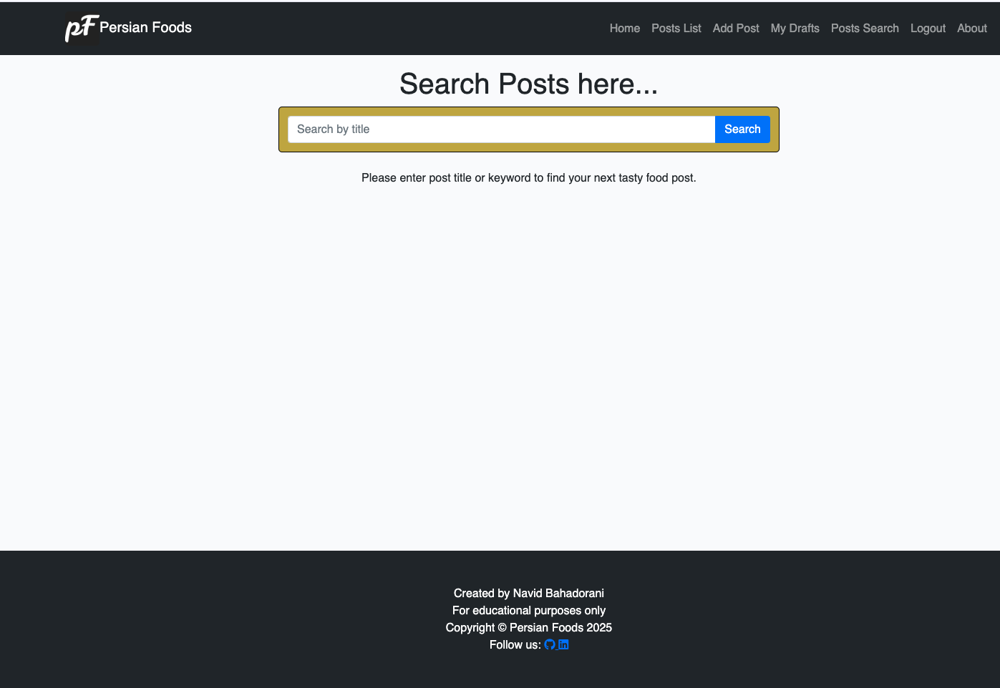

# Persian Foods

Persian Foods is a full-stack web application designed to provide users with a platform to explore, share, and interact with a wide variety of recipes. The website’s goal is to offer a simple, intuitive, visually appealing, and user-friendly space where users can discover recipes shared by food enthusiasts from all over the world, contribute their own recipes, and engage with the community. The target audience is anyone with a passion for cooking and a curiosity about world cuisines, ranging from young adults to older generations.

- The interactive platform incorporates user authentication and full CRUD functionality, allowing users to create, read, update, and delete recipes stored in a relational database. In addition, users can search for recipes, like their favorites, and interact with other community members through comments.
- The Persian Foods website also includes an admin dashboard, enabling administrators to review and approve user comments and manage recipe content.

- The website is built using HTML, CSS, JavaScript, Python, and the Django framework as part of Portfolio Project #4 for the Code Institute’s Full Stack Software Development course.

### [Link to Live Website](https://django-persian-foods-c85134c12b3e.herokuapp.com/)

------

## Table of Contents

 - [Persian Foods](#persian-foods)
   - [Table of Contents](#table-of-contents)
 - [User Experience Design](#user-experience-design)
   - [The Strategy Plane](#the-strategy-plane)
    - [Site Goals](#site-goals)
    - [Agile planning](#agile-planning)
      - [Milestones](#milestones)
      - [User Stories](#user-stories)
   - [The Structure Plane](#the-structure-plane)
      - [Features](#features)
      - [Features Left to Implement](#features-left-to-implement)
   - [The Skeleton Plane](#the-skeleton-plane)
    - [Wireframes](#wireframes)
      - [Desktop Wireframes](#desktop-wireframes)
      - [Mobile Wireframes](#mobile-wireframes)
    - [Database Design](#database-design)
   - [The Surface Plane](#the-surface-plane)
    - [Design](#design)
 - [Technologies](#technologies)
   - [Tools and Technologies](#tools-and-technologies)
   - [Imports](#imports)
    - [Python Packages](#internal-packages)
    - [External Packages](#external-packages)
 - [Testing](#testing)
  - [Responsiveness](#responsiveness)
  - [Accessibility](#accessibility)
  - [Lighthouse](#lighthouse)
  - [Validator Testing](#validator-testing)
    - [HTML Validation](#html-validation)
    - [CSS Validation](#css-validation)
    - [JavaScript Validation](#javascript-validation)
    - [Python Validation](#python-validation)
  - [Manual Testing](#manual-testing)
    - [Functional testing](#functional-testing)
    - [Links and Buttons](#links-and-buttons)
    - [Negative Testing](#neagtive-testing)
  - [Automated Testing](#automated-testing)
    - [Unit Tests](#unit-tests)
 - [Bugs](#bugs)
 - [Deployment](#deployment)
   - [Version Control](#version-control)
   - [Deployment In Heroku](#deployment-in-heroku)
   - [Cloning the Repository](#cloning-the-repository)
   - [Forking](#forking)
 - [Credits](#credits)
 - [Acknowledgements](#acknowledgements)

# User Experience Design

## The Strategy Plane

### Site Goals

The website is designed for everyone who loves cooking and exploring cuisines from around the world, with a special focus on Persian foods. It also caters to those searching for inspiration on days when they want to try something new and discover diverse recipes. The application offers a vibrant and engaging platform for food enthusiasts to explore, share, and indulge in culinary delights, especially from Persian traditions.

Through a user-friendly interface, users can discover a wide range of recipes tailored to their tastes and love for various cuisines.

 - The site allows users to share their favorite recipes, exchange cooking tips, and connect with like-minded food lovers who share a passion for Persian cuisine.
 - Featuring a visually appealing, clean, and earthy design, the site aims to inspire and delight users, whether they are browsing on a desktop or mobile device.

### Agile Planning

I employed the Agile methodology and utilized a GitHub project board to organize and develop my user stories starting from the project planning stage and continuing until the final product was built. To enhance clarity and structure, a user story template is designed that precisely outlines each user story with an acceptance criteria to be fulfilled. Small features have been assigned to 7 milestones.

- All User Stories include:
   - Acceptance Criteria
   - Labels (MoSCoW Prioritization)
- Labels have been used to mark which features the project : 'must have', 'should have', 'could have' and 'nice to have'. The prioritization was done so that a MVP for the project is created in time I have and only focus on the 'should haves' or 'could haves' if the time allows.
- Each User story was checked for the acceptance criteria have been met and closed.

- The detailed Project Board with all user stories can be found here.[Project Board Link](https://github.com/Naviid24/persian-foods-pp4/projects?query=is%3Aopen)

Issues List

Project Board

#### Milestones

- **1 - Initial Project Setup:**
  The first task in starting the project was to setup it up. All the tasks from setting up github repository to installing django, setting up django app and related packages and libraries were included in this milestone. The acceptance criteria was refined for each of the setup to be completed for clarity and ease of understanding. 

- **2 - User Authentication:**
This milestone covers user authentication and authorization i.e. user sign-up, sign-in and logout so that user can explore complete features and functionality of the website.

- **3 - Post Functions:**
All the CRUD functionality and features related to recipes (comments, likes) is included here.

- **4 - User Interface Design (UX/UI):**
The website to be user-friendly and responsive on all devices, this milestone covers the styling aspects of the site, from website pagination to responsiveness and error pages so that user has smooth experience throughout the application.

- **5 - Admin Functionality:** 
Includes admin dashboard functionality so that admin can monitor the website for users, recipes and comments. This milestone was included to keep the admin and site user functionality separate for clarity. 

- **6 - Project Documentation:**
This milestone was needed so that I can document my project in-depth with all website features, testing, deployment information.

- **7 - Final Project Deployment:**
Included as it was absolutely necessary and important to have a live link of fully functional website with no errors so that everyone can have access to the application.

#### User Stories

Each Milestone covers the user stories for small features allowing me to prioritize the most important ones to least in project development.

- **Milestone 1 - Initial Project Setup:**
    - As a developer, I need to set up the recipe blog project with all the necessary components and configurations so that I can ensure a smooth development and deployment process.
       - Initialize and setup a GitHub repository with a README file using CI Gitpod template.
       - Install the latest version of Django.
       - Create a new Django project.
       - Add main app.
       - Verify that the project runs without errors using the Django development server.
       - Add a requirements.txt file listing all project dependencies.
       - Add env.py file to store sensitive information.
       - Add Procfile
       - Implement a proper media storage configuration for user-uploaded images.
            - image database: Cloudinary
       - Configure the project to use a PostgreSQL database.
       - Update the settings.py file to notify Django of the installed supporting libraries .
       - Deploy project to Heroku to test deployment is successful.

    - As a developer, I need to create a base.html file so that I can have a basic structure of the page for the project.
    - As a developer, I need to add static files and media so that I can build the website to be user friendly, interesting and responsive to all screen sizes.
    - As a developer, I need to create a navigation menu so that a website user can easily navigate through the site pages and content.
       - Home Page - for all users
       - Browse Recipes Page - for all users
       - Signup Page - for unauthorised user's registration
       - Login Page - for users already registered
       - Logout Page - for authorised users
       - User Drafts Recipe Page - for authorised users
       - Create new recipes Page - for authorised users
    - As a developer, I need to create a footer so that I can include social media links, contact links and relevant site information about the website.

- **Milestone 2 - User Authentication:**
    - As a developer, I need to setup allauth so that users can have an option to register and sign-in to the website for exploring more features.
      - Install allauth
      - Implement register, login and logout functionality
      - Verify that users can register/ login and logout of their account with an appropriate message displayed.
    - As a Site User I can register an account so that I can access publishing, commenting and like/unlike features.

- **Milestone 3 - Recipe Post Functions:**
   - As a logged-in User, I can create/publish recipes so that I can share recipes that I find delicious with others.
   - As a logged-in User, I can edit the recipes that I have shared so that I can correct and update the recipe details if necessary.
   - As a logged-in User, I can delete my recipes so that they are no longer published on the site.
   - As a Site User, I can view and read the detailed recipes shared/published by others so that I can get some inspiration.
   - As a Site User, I can view a paginated list of recipe posts so that I can select which recipes I want to view.
   - As a logged-in User, I can go to a page to view only my recipes so that I can easily access them if needed.
   - As a Site User, I can search recipes so that I can only view recipes I am interested in.
   - As a Site User, I can leave comments on recipes so that I can interact with others/share my opinion.
   - As a Site User, I can view comments on an individual recipe post so that I can read the conversation.
   - As a logged-in User, I can like/unlike others' recipes so that I can interact with the content.

- **Milestone 4 - User Interface Design (UX/UI):**
    - As a developer, I need to create a home page so that the user can quickly understand what the recipe blog offers and navigate easily to find interesting recipes.
    - As a User, I can navigate between pages easily, so that I can explore the website content without any chaos.
    - As a developer, I want to style the allauth authentication pages(signup, login and logout pages) so that they are visually consistent with the rest of the website and provide a seamless user experience.
    - As a Site User, I can get corresponding feedback after taking an action so that I know whether my actions were successfully run or not.
    - As a User, I want to be directed to a 403 error page when attempting to access content or functionality that I am not authorized to view, so that I am aware of my access limitations and can take appropriate action.
    - As a User, I want to be directed to a custom 404 page when I navigate to a broken link or URL that does not exist, so that I am informed that the page I am looking for is not available and can be directed to other relevant sections of the website.
    - As a user, I am notified in case of an internal error so that I can understand what went wrong and how to proceed.

- **Milestone 5 - Admin Functionality:** 
   - As a developer, I need to create a superuser so that I can manage the website efficiently and ensure the quality and organization of content on the website.
   - As a Site Admin I can create, read, update and delete recipe posts so that I can manage my recipe blog content.
   - As a Site Admin I can approve or disapprove comments so that I can filter out objectionable comments.

- **Milestone 6 - Project Documentation:**
   - As a developer, I need to create readme.md file so that the project is documented in detail.

- **Milestone 7 - Final Project Deployment:**
   - As a developer, I need to make sure the project is deployed to heroku so that everything works and looks as expected.

## The Structure Plane

### Features

### Existing Features

#### Navigation Menu

- As a developer, I need to create a navigation menu so that a website user can easily navigate through the site pages and content. **(User Story#4) (must have)**
- As a User, I can navigate between pages easily, so that I can explore the website content without any chaos. **(User Story#22) (should have)**

##### Navigation bar for all users

##### Navigation bar for authorised users

- The navigation bar is shown on all pages based on the users logged-in(authentication) status and is responsive to all screen sizes. For smaller screen sizes the navigation bar appears as a compact menu and can be easily accessed. A success message is displayed when user is logged-in/ registered.
- The design is kept clean and simple so that user can navigate between the pages easily without any confusion. The links are visible clearly both on large screen and smaller screen sizes. 
- The active link is marked for ease of accessibility so that the user knows the current page been visited.
- The navigation menu includes:
    - Home Page - for all users
    - Recipes Page - for all users
    - Sign up Page - for unauthorised user's registration
    - Sign in Page - for users already registered
    - Logout Page - for authorised users

#### Home Page

- As a developer, I need to create a home page so that the user can quickly understand what the recipe blog offers and navigate easily to find interesting recipes. **(User Story#21) (must have)**

#### Footer

- As a developer, I need to create a footer so that I can include social media links, contact links and relevant site information about the website. **(User Story#5) (must have)**

- The footer section includes the information about the website: the developer of the website, the purpose (for educational purpose only), year developed and the developer's GitHub and LinkedIn links.
- Similar to the navigation bar, the footer is displayed on every page of the website. It displays icon links to GitHub and LinkedIn accounts. These icon links can enable user to see more about my work through GitHub and learn more about me through LinkedIn. Both the links opens in new page.

#### Sign-Up / Sign-In / Logout Pages

- As a developer, I need to setup allauth so that users can have an option to register and sign-in to the website for exploring more features. **(User Story#6) (must have)**

- As a Site User I can register an account so that I can access publishing, commenting and like/unlike features. **(User Story#7) (must have)**

- As a developer, I want to style the allauth authentication pages(signup, login and logout pages) so that they are visually consistent with the rest of the website and provide a seamless user experience.
**(User Story#23) (should have)**

- All the pages are accessible from navigation bar for large and small screen sizes.
- User can easily access the sign-up / sign-in options to explore the website features completely.
- A clear message is displayed on the pages for user to know whether he needs to sign-in or sign-up to explore the recipe website and to like, comment and post the recipes.
- A success message is displayed to user based on his actions for sign-in, sign-up and sign-out.

#### Add Post

- As a logged-in User, I can create/publish posts so that I can share food posts that I find delicious with others. **(User Story#8) (must have)**

- CRUD Functionality - The Add Recipe page link is only visible and accessible to logged-in users. On clicking the Add post link, authorised users are directed to the create post form. The form field marked as * are mandatory to be filled. If user tries to submit the form without entering all required field, messages are displayed below relevant fields that are left empty.
- A default image is incorporated so that if the user is unable to provide any recipe image, the default image will act as one.
- All the fields in the form except the Recipe Image field are required. The form is not deemed to be valid in case any of the fields are left empty. User can either publish or save recipe as draft. 
- Users can share their recipes with others using the add recipe form. On submitting the recipe, user is displayed with a success message and directed to the Recipes page.

#### Edit Post

- As a logged-in User, I can edit the recipes that I have shared so that I can correct and update the recipe details if necessary. **(User Story#9) (must have)**

- CRUD Functionality - the feature of edit in post details page is only visible and accessible to the logged-in users and only if the user is the author of the post.
- On clicking the edit button user is directed to the Edit post form/page where user can update / edit post for any changes and can either save as draft or publish it. On successful update of the post, user is displayed with success message and directed to Posts Page.
- If unauthorised user accesses the link the 403 error page will be displayed.

#### Delete Post

- As a logged-in User, I can delete my posts so that they are no longer published on the site. **(User Story#10) (must have)**

- CRUD Functionality - the feature of delete in post details page is only visible and accessible to the logged-in users and only if the user is the author of the post.
- User is directed to confirm delete page where user can either delete the post or cancel. 
- The post is permanently deleted if delete is confirmed and a success message is diplayed to user else user will be taken back to post details page if cancelled.
- If unauthorised user accesses the link the 403 error page will be displayed.

#### Edit Comments

- As a logged-in User, I can edit the Posts that I have shared so that I can correct and update the recipe details if necessary. **(User Story#9) (must have)**

#### Delete Posts

- As a logged-in User, I can delete my recipes so that they are no longer published on the site. **(User Story#10) (must have)**

- CRUD Functionality - the feature of delete in recipe details page is only visible and accessible to the logged-in users and only if the user is the author of the recipe.
- User is directed to confirm delete page where user can either delete the recipe or cancel. 
- The recipe is permanently deleted if delete is confirmed and a success message is diplayed to user else user will be taken back to recipe details page if cancelled.
- If anauthorised user accesses the link the 403 error page will be displayed.

#### Post Details

- As a Site User, I can view and read the detailed posts shared/published by others so that I can get some inspiration. **(User Story#11) (must have)**

##### Post Details View for authorised users

- User can view a detailed post on this page along with number of comments, number of likes and the all post information.
- The edit and delete buttons are visible and accessible only to the logged-in user as author of the post.
- Logged-in users can explore the post details page completely for like / unlike and comments feature.

##### Post Details View for Logged-in User and author of the post

#### Posts Pagination (Posts Page)

- As a Site User, I can view a paginated list of posts so that I can select which posts I want to view. **(User Story#12) (should have)**

- This feature allows posts to be paginated by 4 posts per page, given more than 1 page the next and prev buttons appear adjacent to each other.
- The posts list page is kept simple so that it is not overcrowded and user can find it easy to navigate between the pages.
- On clicking the Read more button user is taken to post details page to view complete post information.

#### My Drafts Page

- As a logged-in User, I can go to a page to view only my recipes so that I can easily access them if needed.
**(User Story#13) (should have)**

- **Note:** The user story is partially complete. User can only view the posts saved as draft in my drafts page for now. User can update the draft post from my drafts page to either publish or save it for later. 
- This page is only accessible and visible to logged-in users.
- The paginated list of post drafts is displayed with 4 posts per page (if present). With this feature user can create post and save for later as draft for changes or to publish later.
- User can also make his published posts draft for any changes. This feature allows a flexibility for user to share posts and manage them.

#### Search posts Page

- As a Site User, I can search posts so that I can only view posts I am interested in. **(User Story#14) (could have)**

- The search post page allows users to search posts by title or keyword. This page is accessible throughout the website and to all users.
- If the user search results are not found, a message for refining search is provided. Also user is encouraged to share own posts or view all posts.
- If search query is not provided by user, the page is loaded with message to search bu post title or keyword.

#### Comment Section

- As a Site User, I can leave comments on posts so that I can interact with others/share my opinion. **(User Story#15) (should have)**

- As a Site User, I can view comments on an individual post so that I can read the conversation. **(User Story#16) (should have)**

##### Comments Section for author of the comment

##### Comments Section for all logged-in users

#### Like / Unlike Post

- As a logged-in User, I can like/unlike others' posts so that I can interact with the content. **(User Story#17) (should have)**

- The like / unlike feature allows logged-in user to like or unlike the posts.
- Authorised user - likes the posts (if didn't previously liked the post), thumb icon will be displayed - if clicked the icon will change to solid blue color and the number of likes will increase by one.
- Authorised user - unlikes the post (if previously liked the post) , the number of likes will be decreased by one.

#### Admin Functionality

- As a developer, I need to create a superuser so that I can manage the website efficiently and ensure the quality and organization of content on the website. **(User Story#24) (must have)** 
- As a Site Admin I can create, read, update and delete recipe posts so that I can manage my recipe blog content. **(User Story#25) (must have)**
- As a Site Admin I can approve or disapprove comments so that I can filter out objectionable comments. **(User Story#26) (must have)**

- The most important task for website to function was to create a superuser, to manage the recipe post functionality and the website entirely.
- The admin can ensure the quality and organization of the content on the webite.
- When the comment is made by any user on the post, the comment awaiting approval message is displayed to user. The comment is only displayed if it approved by admin.
- The admin panel helps the administrator to have control over the website to function seamlessely and keep the website content meaningful and organized.

#### Feedback on user actions

- As a Site User, I can get corresponding feedback after taking an action so that I know whether my actions were successfully run or not. **(User Story#18) (must have)**

- This feature informs the user if the action taken has been successful so that user can know the outcome of every action throughout while navigating the website.
- Message will be displayed when :
    - User Sign In / Sign Up / Logout
    - User posted a recipe
    - User edited the recipe
    - User deleted the recipe
    - User comments on a recipe

#### Error Pages

- As a User, I want to be directed to a 403 error page when attempting to access content or functionality that I am not authorized to view, so that I am aware of my access limitations and can take appropriate action.
**(User Story#27) (must have)**
- As a User, I want to be directed to a custom 404 page when I navigate to a broken link or URL that does not exist, so that I am informed that the page I am looking for is not available and can be directed to other relevant sections of the website. **(User Story#28) (should have)**

- As a user, I am notified in case of an internal error so that I can understand what went wrong and how to proceed. **(User Story#29) (nice to have)**

- The custom error pages are displayed if user encounters an error while accessing unauthorised link(access denied), user navigates to a page not present(page not found), or if there is internal error while rendering the user requested resource.
- This feature communicates to the user about what went wrong and gives option to go back to the home page. This gives user an option to navigate the website again without leaving it.
- The message displayed for each of the error is user-friendly and gives user an easy to access option to go back to home page through providing the home page link.

#### Initial Project Setup / Project Documentation / Final Project Deployment
All the user stories are completed for project setup, project documentation and final project deployment

- As a developer, I need to set up the Persian Foods blog project with all the necessary components and 
  configurations so that I can ensure a smooth development and deployment process. **(User Story#1) (must have)**
    - Initialize and setup a GitHub repository with a README file using CI Gitpod template.
    - Install the latest version of Django.
    - Create a new Django project.
    - Add main app.
    - Verify that the project runs without errors using the Django development server.
    - Add a requirements.txt file listing all project dependencies.
    - Add env.py file to store sensitive information.
    - Add Procfile
    - Implement a proper media storage configuration for user-uploaded images.
            - image database: Cloudinary
    - Configure the project to use a PostgreSQL database.
    - Update the settings.py file to notify Django of the installed supporting libraries .
    - Deploy project to Heroku to test deployment is successful.

- As a developer, I need to create a base.html file so that I can have a basic structure of the page for the project. **(User Story#2) (must have)**
- As a developer, I need to add static files and media so that I can build the website to be user friendly, interesting and responsive to all screen sizes. **(User Story#3) (must have)**
- As a developer, I need to create Readme.md file so that the project is documented in detail. **(User Story#19) (must have)**
- As a developer, I need to make sure the project is deployed to heroku so that everything works and looks as expected. **(User Story#20) (must have)**

### Features left to implement

- Implement a customizable User profile section where user can add personal information (profile picture / avatar, bio, interests, favourite recipes) and view his published and draft recipes (currently user can view only draft recipes in my drafts page).
- Add a feature that allows users to click on the author's name and view all the Posts published by that author.
- Add a search page to search all posts of the blog
- Enhance search functionality to search for recipes based on FuzzySearch.
- Provide users with social media options to login.
- Add a subscription feature so that user can get latest posts through email.
- Add a feature on an individual profile to follow eachother

## The Skeleton Plane

#### Desktop Wireframes
Wireframes for Large Screen Sizes 

#### Home Page 

#### Posts List page
This page is accessible for just logged-in users

#### Add Posts page

#### Search Posts page

#### My Drafts page

#### About page

#### Sign In page

#### Sign Out page

#### Sign Up page

#### Mobile Wireframes
Wireframes for Small Screen Sizes

#### Home Page 

#### Posts List page
This page is accessible for just logged-in users

#### Add Posts page

#### Search Posts page

#### My Drafts page

#### About page

#### Sign In page

#### Sign Out page

#### Sign Up page

### Database Design

- The database ER diagram was designed using [SmartDraw](https://www.smartdraw.com). The main Post model contains all the fields needed for the post to be complete. Additional fields (like category, nutritional value, meals type., etc) can be added to further enhance the website, but the values are not vital for the site to work and can be added later.
- The diagram shows relationaships between the Post model, Comments Model, Like Model and django's allauth User model as follows:
   1. User to Post: One-to-Many (1:M)
       - Each user can create multiple posts.
       - Each post is created by one user.
   2. Post to Comment: One-to-Many (1:M)
       - Each post can have multiple comments.
       - Each comment is associated with one post.
   3. User to Comment: One-to-Many (1:M)
       - Each user can make multiple comments.
       - Each comment is made by one user.

- In summary, User can create multiple posts, and each post is associated with one user. Post can have multiple comments, and each comment is associated with one post. User can make multiple comments, and each comment is made by one user.
- These relationships was implemented using ForeignKey fields in the models. The Post model have a ForeignKey field referencing the User model to represent the creator of the post, and the Comment model have ForeignKey fields referencing both the Post model and the User model to represent the post being commented on and the user making the comment, respectively.

## The Surface Plane

### Design

The website uses clean, simple design with earthy colours and images that showcases the primary goal of the website. The aim here was to keep the site clutter-free so that user can have a smooth straight-forward navigation experience throughout without any chaos and confusion.

#### Typography

- The images in this project are sourced from [Pexels](https://www.pexels.com/) and [Pixabay](https://pixabay.com/). They were specifically selected to correlate with the main purpose of the website and to give user a imagery representation for the post content to increase impact of the design.

## Technologies

### Tools and Technologies
 
- Visual Studio Code - used to develop the website
- [GitHub](https://github.com/) to host the source code. 
- Git to provide the version control to commit and push code to the repository.
- HTML - used to create main static content of the website
- Bootstrap - front end framework used
- CSS- used for website styling
- JavaScript- used to create dynamic content and make page interactive
- Python - used as the main language to code the logic of the page
- Django - framework used
- Heroku - to deploy the app
- ElephantSQL - A free cloud based PostgreSQL database system used for the application database.
- [FontAwesome](https://fontawesome.com/v5/search) v5.15.4 for website icons.
- [Favicon.io](https://favicon.io/) to create the website favicon.
- [Cloudconvert](https://cloudconvert.com/jpg-to-webp) to convert .jpg images into .webp to reduce storage 
    and enhance the website performance.
- [TinyJPG](https://tinyjpg.com/) to optimise images for website.
- Balsamiq to design the wireframes for the website.
- Google Chrome's Lighthouse to test accessibility for desktop and mobile devices.
- [W3C HTML Markup Validator](https://validator.w3.org/) to validate the HTML Code.
- [W3C Jigsaw CSS Validator](https://jigsaw.w3.org/css-validator/) to validate the CSS Code.
- [jshint validator](https://jshint.com/) - used to check java script code for errors.
- [SmartDraw](https://www.smartdraw.com/) used to generate the ER Diagram
- [Am I Responsive](http://techsini.com/) to create the Mockup image in this README.
- Code Institute's Gitpod Template to generate the workspace for the project.
- BrowserStack for cross-browser testing.

### Imports

#### Python Packages
- Summernote - used to provide an editor for user and admin for adding recipes instructions and ingredients.
- TemplateView, CreateView, ListView, DeleteView, UpdateView - used to allow CRUD functionality
- LoginRequiredMixin, UserPassesTestMixin - used to test and secure views from unauthorised access.
- messages - used to add action messages to user on submission
- HttpResponseRedirect, reverse : used to direct user to specific URL
- get_object_or_404: used to get specific object from database or raise 404 exception if not found

  

